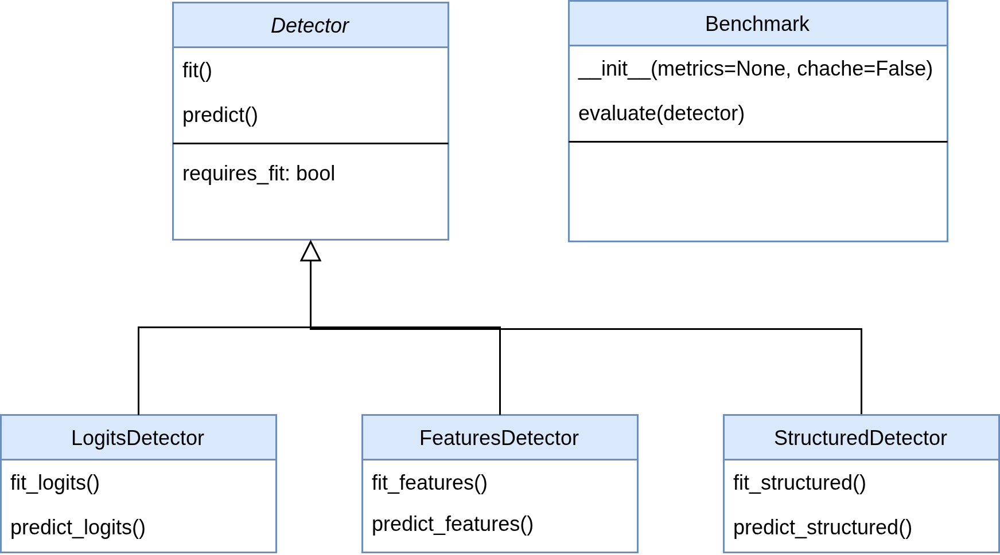

# Summary

Out-of-distribution (OOD) detection is a central problem in modern machine learning, especially in safety-critical settings where predictive systems must recognize when an input no longer resembles the data seen during training @yang2021generalized. Although the field has developed rapidly, practical experimentation remains fragmented.
Implementations are often tied to individual papers, method interfaces vary considerably, and evaluation protocols can be difficult to reproduce.
`pytorch-ood` aim to address this problem by providing a unified, research-oriented software library for OOD detection in the PyTorch ecosystem @paszke2019pytorch.
The package combines a broad collection of detectors, training objectives, datasets, pretrained models, and evaluation utilities behind a consistent interface, thereby reducing engineering overhead and making controlled comparisons easier to conduct.

The library is designed for researchers who need both breadth and modularity. Rather than focusing on a single benchmark or a narrow family of methods, `pytorch-ood` aims to provide a reusable framework for OOD detection research.
Its associated publication has been cited over 60 times, indicating sustained scholarly uptake, and the package has also seen substantial download activity as a software artifact.
The project therefore serves not only as a code release for a single paper, but as reusable research infrastructure for a broader community.

# Statement of need

Research on OOD detection faces a recurring methodological problem: many published methods are conceptually comparable, but difficult to compare in practice.
Small implementation differences in preprocessing, score orientation, model wrapping, or metric computation can materially affect conclusions. At the same time, reproducing baselines often requires re-implementing large amounts of auxiliary code for dataset handling, evaluation, and model integration.
This duplication of effort slows down research and makes empirical claims harder to audit.

`pytorch-ood` was developed to reduce this friction.
The package provides a unified API for detectors and related components, while also covering a broad range of methods and benchmark datasets. This design makes it possible to reuse trained models across detectors, to evaluate methods under a shared interface, and to integrate new ideas without rebuilding the surrounding infrastructure.
The resulting workflow is lighter than bespoke per-paper implementations and more flexible than fixed benchmark pipelines. In that sense, `pytorch-ood` is intended as a middle layer between individual research code and pure benchmarking frameworks: it offers standardization where standardization is useful, without sacrificing too much flexibility.

# Functionality

The functionality of `pytorch-ood` spans the main stages of the OOD detection workflow. At the detector level, the package implements a broad range of established methods, including ones based on predicted posteriors, logits, latent representations, model gradients, etc.
These methods are exposed through a shared abstraction, which makes them easier to interchange in comparative experiments.

Beyond post-hoc detection, the package also supports training-based approaches, where the training objective of a neural network is modified to improve OOD discriminability.

A further feature of the package is its support for datasets and benchmarks.
`pytorch-ood` allows manual, metric-based evaluation using `OODMetrics`, while the benchmark submodule implements higher-level evaluation through benchmark objects such as OpenOOD v1.5, which can evaluate a detector on several common OOD datasets under one interface.
This combination is useful because it supports both low-level custom evaluation loops and higher-level benchmark experiments.

# Design and architecture
The core architectural principle of `pytorch-ood` is interface unification.
All methods implement a shared `Detector` abstraction with a `predict()` method for mapping inputs to outlier scores and, where needed, an optional `fit()` method for calibration or training.

Beyond this common interface, the library provides specialized detector types such as `LogitDetector` and `FeatureDetector`, which differ by the representation they consume rather than by their external API.
For instance, logit-based detectors operate directly on model outputs, while feature-based detectors use intermediate representations.
This separation makes detectors easy to interchange in experiments and enables computational reuse, since extracted logits or features can be shared across multiple methods.




# Comparison to existing tools

Several tools for OOD detection already exist (even though most were released after `pytorch-ood`), and some, like OpenOOD @zhang2023openood, place a stronger emphasis on standardized benchmark pipelines.
On the other hand, FrOODo @stieber2022froodo focuses on the medical domain.
`pytorch-ood` occupies a somewhat different point in the design space.
Its primary goal is not to prescribe a single evaluation regime, or a particular application domain, but to provide a flexible PyTorch-native library in which detectors, losses, models, datasets, and benchmarks share a coherent interface.
This makes the package particularly suitable for exploratory research, baseline construction, ablation studies, and the rapid integration of new detection ideas into existing PyTorch workflows.
The package is therefore best understood not as a replacement for benchmark-centric frameworks, like OpenOOD, but as complementary infrastructure that prioritizes modularity and reuse.

# Example usage

A minimal evaluation workflow to replicate the CIFAR10 OpenOOD benchmark for a pre-trained model be written directly as:

```python
from pytorch_ood.detector import EnergyBased
from pytorch_ood.model import WideResNet
from pytorch_ood.benchmark import CIFAR10_OpenOOD

device = "cuda"

model = WideResNet(num_classes=10, pretrained="er-cifar10-tune").eval()
preprocess = WideResNet.transform_for("er-cifar10-tune")
detector = EnergyBased(model).to(device)

benchmark = CIFAR10_OpenOOD(root="data", transform=preprocess)

metrics = benchmark.evaluate(detector, loader_kwargs={"batch_size": 64}, device=device)

print(metrics)
```
